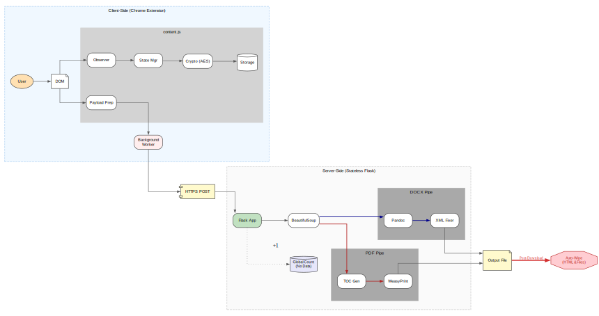

# Document Suite for ChatGPT

**Document Suite for ChatGPT** addresses the critical formatting limitations found when exporting ChatGPT conversations. While ChatGPT renders LaTeX equations and tables correctly on-screen, standard DOCX exports often strip essential LaTeX rules (like `\hline` and `\cline`) and corrupt table borders.

This suite provides a robust solution for organizing, selecting, and exporting chat content with high fidelity, ensuring a lossless conversion for complex mathematical and structural data.

## 1. Export Capabilities

Stop relying on copy-paste. The suite offers flexible export options directly from the chat interface.

### Export Individual Responses
Easily export a single specific response (including code and tables) to DOCX or PDF without including the rest of the conversation.

### Export Entire Chat
Convert a full conversation history into a polished document with a single click.

## 2. Organization: Lists & Folders

Manage complex research across multiple chats using a hierarchical file system.

* **Lists:** High-level containers (Topics) that hold related folders.
* **Folders:** Store an ordered sequence of responses or specific sections.
* **Active Folder:** The currently selected folder is highlighted with a border. Any content you select in the chat is automatically added to this **Active Folder**.

### Drag and Drop Reordering
You can easily reorganize your content by dragging and dropping items:
* **Reorder Sections:** Drag specific responses up or down within a folder to change their sequence.
* **Move Between Folders:** Drag a response from one folder and drop it into another to restructure your document instantly.

**Other Folder Actions:**
* **Swap/Reorder:** Quick buttons to swap contents within a folder.
* **Expand/Collapse:** Toggle folder views to keep your workspace clean.
* **Delete/Edit:** Rename folders or delete them (with confirmation) to remove all contained responses.

## 3. Advanced Selection Mode

Gain total control over what you export. You don't have to export the whole thread if you only need specific parts.

### Section Selection (Removing Fillers)
Enable **"Select Sections"** in the Preferences to curate your document granularly. This allows you to remove conversational fillers (e.g., *"Here is the code you asked for..."*) and keep only the technical content.

**Interaction Guide:**
1.  **Double-Click (Select All):** Double-clicking a response frame selects **all** sections within that message.
2.  **Single-Click (Select/Unselect Specifics):**
    * Hover over a specific element (Table, Code block, LaTeX formula).
    * **Click once** to select it individually.
    * **Unselect:** If an entire response is selected, **single-click** specific sections (like filler paragraphs) to remove them from the selection while keeping the rest.

## 4. Numbering System (X.Y)

To ensure your document flows logically—even when you select items out of order—the suite uses a strict ID system:

> **Format: X.Y**

* **X (Folder ID):** The specific folder the content belongs to.
* **Y (Section ID):** The sequence of the section within that folder.

**Logic:** A section labeled **1.7** will always be placed before **2.3** in the final exported document.

## 5. PDF vs. DOCX Export

Understanding the difference between the formats is crucial for maintaining layout fidelity.

* **DOCX (Standard):** Good for editable text, but often drops LaTeX rules (`\hline`, `\cline`) and table semantics, leading to structural formatting loss.
* **PDF (Lossless):** Recommended for complex data. The suite uses a direct HTML-to-PDF pipeline that preserves all LaTeX formatting, complex equations, and table borders exactly as they appear on screen.

## 6. Preview Mode

Verify your document structure before downloading.

* **Visual Preview:** See exactly how your content—tables, code, and text—will be ordered.
* **New Tab Option:** Open the preview in a new tab to inspect the full layout sequence before committing to the export.

## 7. Storage & Privacy

* **Local Storage:** All Lists, Folders, and selections are encrypted and stored entirely within your browser's local storage.
* **Stateless Server:** The backend server is used strictly for file conversion. It **does not store** your files; they are deleted immediately after the export is processed.
* **Hassle-Free:** Your organization is saved automatically, so you can close the browser and resume your work later without data loss.

### System Architecture

## 8. License

Licensed under the **Apache License, Version 2.0** or the **MIT License** (the "Licenses"), at your option. You may not use this file except in compliance with one of these Licenses.

See `LICENSE` for more information.

**Acknowledgements:**
* **Icons:** Custom-designed by the author, with additional assets provided by [Google Fonts Icons](https://fonts.google.com/icons).

## 9. Installation Steps (Standard)

For detailed, step-by-step instructions on how to load this extension into Chrome or Brave in Developer Mode, please refer to the official guide included in this repository.

**Note:** By default, this extension uses a **Public Server** for PDF conversions. While convenient, this shared server may experience latency during high traffic. For faster and more secure exports, we recommend the Private Server setup below.

[📄 **Open Installation Guide (PDF)**](installation-guide.pdf)

## 10. Private Server Setup (Hugging Face Spaces)

**Highly Recommended:** To ensure total privacy and bypass public server queues, you can deploy your own dedicated conversion server on **Hugging Face Spaces** for free.

**Official Server Source:**

This ensures:
* **Zero Wait Times:** No queueing behind other users.
* **Total Privacy:** Your data never touches our public infrastructure.
* **Reliability:** Your own personal endpoint.

To get started, simply go to the [Official Server Space](https://huggingface.co/spaces/realprudhvi/chatgpt-exporter-server) and click **"Duplicate this Space"**.

[📂 **Open Private Server Guide (PDF)**](private-server-guide.pdf)
